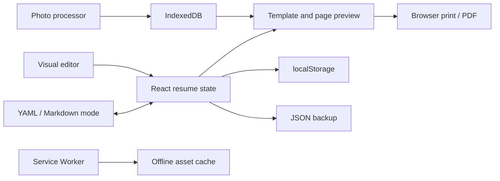

  

<h1 align="center">BeeTales Resume Builder</h1>

  A private, multilingual, open-source resume builder that runs entirely in the browser.

  <a href="https://sorairei.github.io/BeeTales-Resume-Builder/"><strong>Open the live application</strong></a>
  ·
  <a href="https://github.com/Sorairei/BeeTales-Resume-Builder/issues">Report an issue</a>
  ·
  <a href="https://github.com/sponsors/Sorairei">Sponsor the project</a>

  
  
  

## Overview

BeeTales Resume Builder creates professional resumes without accounts, subscriptions, watermarks, tracking, or server-side processing. Resume content stays in the user's browser, profile photos are compressed before storage, and portable backups make it possible to move data between devices.

The production application is a collection of static HTML, CSS, JavaScript, images, and PWA files hosted on GitHub Pages. No backend, database server, API key, private API, serverless function, or URL rewrite is required.

## Contents

- [Highlights](#highlights)
- [Templates](#templates)
- [How it works](#how-it-works)
- [Text mode and automation](#text-mode-and-automation)
- [Data and privacy](#data-and-privacy)
- [Architecture](#architecture)
- [GitHub Pages and offline support](#github-pages-and-offline-support)
- [ATS and PDF behavior](#ats-and-pdf-behavior)
- [Accessibility and languages](#accessibility-and-languages)
- [Quality and security](#quality-and-security)
- [Limitations](#limitations)
- [Contributing](#contributing)
- [Sponsorship](#sponsorship)
- [License](#license)

## Highlights

| Area | Capabilities |
| --- | --- |
| Resume content | Personal details, summary, experience, education, skills, languages, certifications, projects, courses, references, and custom sections |
| Editing | Live preview, repeatable entries, duplication, deletion, section visibility, drag-and-drop ordering, and accessible move controls |
| Design | Eight templates, six accent palettes, custom colors, contrast feedback, fonts, safe font scaling, spacing, margins, dividers, A4/Letter, and photo controls |
| Profile photo | Optional upload, browser-side resize and JPEG compression, crop position, zoom, shape, and three display sizes |
| ATS guidance | Transparent local checks for contact details, content completeness, links, contrast, page count, photos, and multi-column layouts |
| Export | Native printing and PDF saving with selectable text, searchable content, and working links |
| Portability | Validated JSON backup and restore, plus YAML/Markdown import and export |
| Privacy | No accounts, analytics, remote storage, API keys, or external processing |
| Offline use | Installable PWA with a GitHub Pages-aware Service Worker |
| Languages | English, Spanish, Polish, and Portuguese |

## Templates

All templates use real HTML text. Changing templates never removes resume content.

| Template | Layout | ATS profile | Photo | Recommended use |
| --- | --- | --- | --- | --- |
| ATS Classic | Linear single column | High | Hidden intentionally | Applications where automated parsing is the priority |
| Modern | Contemporary header | Medium-high | Optional | General professional and corporate roles |
| Executive | Refined editorial hierarchy | Medium-high | Optional | Senior, leadership, and consulting profiles |
| Two-column | Main content with visual sidebar | Medium | Optional | Compact resumes with skills and languages |
| Swiss Grid | Structured editorial grid | High | Optional | Design-aware professional profiles |
| Tech Compact | Dense technical layout | High | Optional | Engineering, product, data, and technology roles |
| Contemporary Timeline | Chronological layout with markers | Medium-high | Optional | Career stories with a strong progression |
| Studio | Expressive portfolio composition | Medium | Optional | Creative, design, and portfolio-oriented work |

## How it works

1. The user edits structured resume fields or imports a backup/text file.
2. React updates the application state and the selected template immediately.
3. Text, settings, and preferences are saved to `localStorage` after a short debounce.
4. A profile photo is resized, compressed, and stored separately in IndexedDB.
5. The preview measures the rendered document and reports page count or overflow risk.
6. Printing uses the browser's native print engine so the resume remains text-based.

The **Reset** action clears the resume content and design settings. **Data and backups** provides portable export/import controls and a permanent local-data reset.

## Text mode and automation

Text mode provides a structured alternative to the visual editor:

| Format | Purpose | Behavior |
| --- | --- | --- |
| YAML | Automation and precise structured editing | Acts as the authoritative portable text format |
| Markdown | Human-readable sharing and editing | Stores the structured resume in YAML front matter and regenerates the readable section |

Valid edits synchronize back to the visual editor automatically. Invalid or incomplete text is reported without replacing the current resume. Imported text preserves the local IndexedDB photo, while exported text deliberately excludes binary photo data.

## Data and privacy

| Data | Browser storage | Sent to a server? | Included in JSON backup? |
| --- | --- | --- | --- |
| Resume text | `localStorage` | No | Yes |
| Design settings and language | `localStorage` | No | Yes |
| Profile photo | IndexedDB | No | Yes, as compressed image data |
| YAML/Markdown files | User-selected local files | No | Photo excluded |

The application contains no analytics, advertising trackers, authentication, cloud sync, private APIs, or secrets. Clearing the site's browser storage removes the locally saved resume, so users should export a JSON backup before clearing browser data or changing devices.

Downloaded resume and backup files contain personal information and should be handled accordingly.

## Architecture

### Repository structure

| Path | Responsibility |
| --- | --- |
| `src/components/editor/` | Forms, design controls, ordering, backups, and Text Mode UI |
| `src/components/preview/` | Resume document renderer, page measurement, preview, and print actions |
| `src/components/ats/` | Local ATS-oriented observations and scoring presentation |
| `src/data/` | Default/empty resume data, templates, palettes, and translations |
| `src/hooks/` | Resume state, autosave, photo lifecycle, import, export, and reset orchestration |
| `src/services/` | Storage, image processing, PWA registration, printing, backups, and text serialization |
| `src/utils/` | Validation, migrations, ATS analysis, layout rules, dates, IDs, ordering, and tests |
| `src/styles/` | Application shell, refined brand system, resume templates, and print-only rules |
| `public/` | Favicons, manifest, Service Worker, logo, and mascot assets copied to production |
| `.github/workflows/` | Automated validation, static build, and GitHub Pages deployment |

### Main design boundaries

- **Data model:** TypeScript types plus Zod validation define the portable resume format.
- **State layer:** `useResume` owns state transitions and persistence orchestration.
- **Presentation layer:** editor controls and resume templates consume the same state.
- **Storage layer:** text and binary assets are deliberately separated.
- **Export layer:** JSON, YAML, Markdown, and browser-native print remain client-side.
- **Migration layer:** older supported resume versions are normalized before use.

## GitHub Pages and offline support

The deployment workflow validates the project, creates `dist`, uploads the static artifact, and publishes it through GitHub Pages. Vite calculates its `base` from `GITHUB_REPOSITORY` during GitHub Actions:

| Repository type | Production base |
| --- | --- |
| Project site | `/repository-name/` |
| `username.github.io` site | `/` |

This keeps scripts, styles, images, the manifest, and the Service Worker valid when the application is hosted at `https://username.github.io/repository-name/`.

The PWA uses a scope-relative application shell and runtime caching. Offline use becomes available after the required assets have been loaded successfully at least once.

## ATS and PDF behavior

- ATS Classic uses a linear reading order, standard headings, real text, and no photo.
- Visual templates keep selectable text but may be interpreted differently by older ATS software.
- The ATS review is an explainable local checklist, not an acceptance prediction.
- **Save PDF** and **Print** open the browser's native print dialog.
- Print-specific CSS removes the application interface and preserves resume colors.
- A4 and Letter formats are supported.
- Page-break guidance is based on the rendered preview and may vary slightly between browser print engines.

No resume builder or template can guarantee acceptance by an ATS or recruiter.

## Accessibility and languages

The interface includes keyboard-accessible ordering controls, visible focus states, semantic labels, status announcements, responsive navigation, contrast guidance, and non-color status cues where practical.

English is the default language. The complete interface is also available in Spanish, Polish, and Portuguese. Translation dictionaries are checked for matching, non-empty keys during automated tests.

## Quality and security

The GitHub Pages workflow performs the following checks before deployment:

| Check | Purpose |
| --- | --- |
| Deterministic dependency install | Uses the committed lockfile and pinned direct dependency versions |
| ESLint | Detects code-quality and React hook issues |
| Automated tests | Covers schema safeguards, migrations, ordering, templates, translations, backups, Text Mode, ATS analysis, and filenames |
| TypeScript build | Rejects type errors before production output is created |
| Vite production build | Produces the static `dist` artifact used by GitHub Pages |

The project has no production server surface, database credentials, API tokens, or private endpoints. Imported data is size-limited and validated before it replaces the active resume.

## Limitations

- Data does not synchronize automatically between browsers or devices; JSON/YAML/Markdown files provide portability.
- Browser storage is origin-specific and can be removed by the user or browser cleanup tools.
- Offline support requires a successful online visit before all required assets are cached.
- Print output can vary slightly by browser, operating system, paper settings, and enabled background graphics.
- Multi-column and highly visual templates may be less compatible with older ATS parsers.
- The application does not provide cloud collaboration or server-side PDF generation by design.

## Contributing

Contributions, bug reports, translation improvements, and new template proposals are welcome. Please read [CONTRIBUTING.md](CONTRIBUTING.md) and use [GitHub Issues](https://github.com/Sorairei/BeeTales-Resume-Builder/issues) for reproducible problems or feature discussions.

All contributions must preserve the browser-only privacy model and GitHub Pages compatibility.

## Sponsorship

BeeTales Resume Builder is free and open source. If it saves you time or helps your job search, you can support continued maintenance through [GitHub Sponsors](https://github.com/sponsors/Sorairei).

## License

Released under the [MIT License](LICENSE). Copyright © 2026 [Sorairei](https://github.com/Sorairei).

---

  Built with care by <a href="https://github.com/Sorairei">Sorairei</a> and the BeeTales community.

